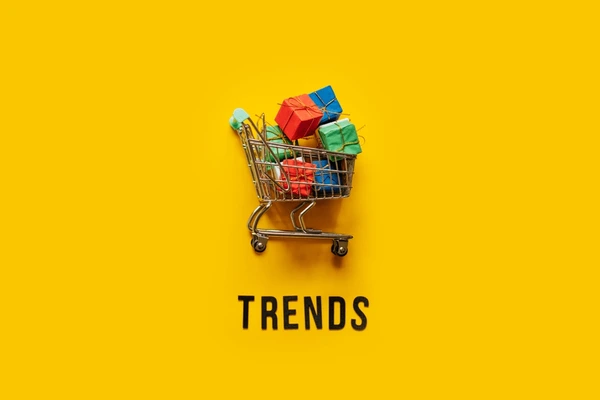

# Identifying Shopping Trends using Data Analysis

## Table of Contents

- [Project Overview](#Project-overview)
- [Dataset](#Dataset)
- [Project Repository Structure](#Project-Repository-Structure)
- [Project Dependencies](#project-dependencies)
- [Project Workflow](#project-workflow)
- [Results and Insights](#results-and-insights)
- [Conclusion](#conclusion)
- [Acknowledgment](#acknowledgments)
- [Contact Information](#contact-information)

## Project Overview

This project focuses on identifying shopping trends using data analysis, providing insights into customer behavior, purchasing patterns, and key factors influencing sales.

## Dataset

The dataset consists of 3,900 customer transactions, capturing various details such as customer demographics, purchase behavior, and product preferences. It includes features like age, gender, item purchased, category, purchase amount, location, season, review ratings, subscription status, payment method, and discount usage.

This dataset enables the analysis of spending habits, most popular products, seasonal trends, and the impact of discounts and promotions on customer purchases.

## Project Repository Structure

The repository is organized as follows:

1. **README.md**: Provides an overview of the project.
2. **ipynb notebook/**: Contains a Jupyter notebook with the full code.

## Project Dependencies

This project depends on the following Python libraries:

- Pandas
- NumPy
- Matplotlib
- Seaborn
- Plotly

## Project Workflow  

1. **Data Pre-Processing**: The dataset was cheaked to ensure consistency and accuracy, handling missing values, duplicates, and formatting issues for effective analysis.  

2. **Exploratory Data Analysis (EDA)**: Various data visualizations and statistical techniques were used to analyze customer demographics, purchase behavior, seasonal trends, and product preferences.  

3. **Shopping Trend Analysis**: Shopping trends were identified by examining factors such as Average purchase amount across categories, most frequently bought items, Seasonal variations in spending behavior, and differences in spending habits based on customer demographics.
   
4. **Customer Segmentation**: Customers were categorized based on attributes like subscription status, payment preferences, and purchasing frequency to identify behavioral trends and target audience groups. 

## Results and Insights

Factors influencing buying decisions were analyzed, including:
1. Impact of discounts and promo codes
2. Relationship between product size and purchase amount
3. Preferred shipping methods for different product categories
4. Correlation between review ratings and purchase amounts

Based on the findings, actionable strategies were proposed to optimize marketing campaigns, enhance customer retention, and improve product recommendations.

## Conclusion 

This project provides valuable insights into customer shopping trends by analyzing purchasing behavior, preferences, and key influencing factors. We identified patterns in age distribution, product preferences, seasonal spending, and the impact of discounts and reviews. These findings can help businesses optimize marketing strategies, enhance customer experience, and improve decision-making in product recommendations and promotions. Further improvements could involve integrating advanced machine learning models for predictive analytics and real-time customer behavior analysis.

## Acknowledgment

I would like to express my sincere gratitude to AICTE for providing this project under the AI internship of the TechSaksham initiative, a joint CSR program by Microsoft and SAP. Additionally, I am thankful to my peers and the learning community for their collaboration, making this project insightful and enriching.

## Contact Information

For further information, please contact:

Abhinandh C S

Email: abhinandhcs77@gmail.com
